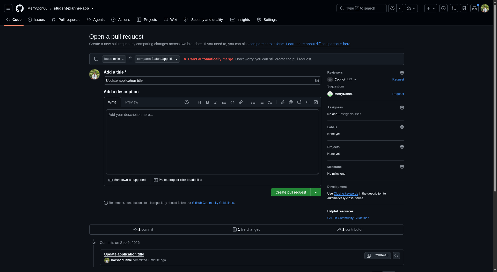

# Student Information System

A lightweight, collaborative web application developed as part of a hands-on Git & GitHub collaborative workflow exercise.

---

## 👥 Team Members & Roles

| Name | Role | Responsibilities |
| :--- | :--- | :--- |
| **Merry Don** | Student 1 (Team Lead / Integrator) | Repository setup, base project scaffolding, PR reviews & merging |
| **Jinisha Leema Rosario** | Student 2 (UI / Frontend Developer) | HTML/CSS enhancements, card layout, styling, contact details |
| **Darshan Pundlik Heble** | Student 3 (JavaScript Developer) | Interactive JS functionality, event handling, conflict resolution |

---

## 📖 Project Description

The **Student Information System** is a minimalist front-end application displaying student records (Name, Register Number, Programme, Academic Year, and Contact details) with interactive detail toggling. 

The primary goal of this project is to practice and demonstrate **real-world collaborative Git workflows**, including:
- Branch-per-feature development
- Meaningful commit hygiene
- Pull Request (PR) peer reviews and merges
- Creating and resolving intentional merge conflicts

---

## 🛠️ Technologies Used

- **HTML5**: Page structure and semantic layout
- **CSS3**: Responsive card styling, typography, and clean modern aesthetic
- **JavaScript (ES6)**: Dynamic DOM manipulation and details toggle logic
- **Git & GitHub**: Version control, branch management, code review, and conflict resolution

---

## 🌿 Git Branching Strategy

We followed a feature-branch workflow where the `main` branch is kept stable, and all work is done on isolated branches merged via Pull Requests:

```
feature/ui           ──┐
                       ├──> (PR Review) ──> main ──●
feature/javascript   ──┤                            \
                       │                             ├──> Merge Conflict & Resolution ──> main
feature/contact      ──┤                            /
                       ├──> (PR Review) ──> main ──●
feature/student-name ──┤
feature/app-title    ──┘
```

### Branches Created:
- `main`: Production-ready, stable codebase.
- `feature/ui`: Enhanced styling and card structure.
- `feature/javascript`: Added dynamic student information toggle.
- `feature/contact`: Added email and phone contact details.
- `feature/student-name`: Updated the heading to *"Student Management System"*.
- `feature/app-title`: Updated the heading to *"MCA Student Information Portal"* (conflict trigger).

---

## 🔄 Pull Requests Created

1. **PR #1 (`feature/ui` → `main`)**: Improved UI layout, card design, and buttons.
2. **PR #2 (`feature/javascript` → `main`)**: Added dynamic details display functionality.
3. **PR #3 (`feature/contact` → `main`)**: Integrated contact info section.
4. **PR #4 (`feature/student-name` → `main`)**: Modified header title.
5. **PR #5 (`feature/app-title` → `main`)**: Triggered merge conflict against PR #4 and merged after resolution.

---

## ⚔️ Merge Conflict: Cause & Resolution

### What Caused the Conflict?
Both `Student 2` (`feature/student-name`) and `Student 3` (`feature/app-title`) branched off from the same commit on `main` and modified the exact same line in `index.html` differently:

- **Student 2 changed line to:**
  ```html
  <h1>Student Management System</h1>
  ```
- **Student 3 changed line to:**
  ```html
  <h1>MCA Student Information Portal</h1>
  ```

When `feature/jinisha` was merged first, GitHub flagged a conflict on `feature/app-title`'s PR because Git could not automatically decide which title to keep.

#### Conflict Evidence on GitHub:


### How Was It Resolved?
1. Fetched the latest `main` branch:
   ```bash
   git checkout main
   git pull origin main
   git checkout feature/app-title
   git merge main
   ```
2. Git marked the conflict in `index.html`:
   ```html
   <<<<<<< HEAD
   <h1>MCA Student Information Portal</h1>
   =======
   <h1>Student Management System</h1>
   >>>>>>> main
   ```
3. The conflict was resolved collaboratively by combining both titles:
   ```html
   <h1>Student Management System – MCA</h1>
   ```
4. Removed all conflict markers (`<<<<<<<`, `=======`, `>>>>>>>`), staged, and committed:
   ```bash
   git add index.html
   git commit -m "Resolve merge conflict in application title"
   git push origin feature/app-title
   ```
5. The Pull Request was successfully approved and merged.

---

## 🚀 How to Run the Application

No build tools or server setup required!

### Option 1: Direct in Browser
Double-click [index.html](file:///home/darshan/Projects/student-planner-app/index.html) or run via terminal:
```bash
xdg-open index.html
```

### Option 2: Using Python HTTP Server
```bash
python3 -m http.server 8000
```
Open [http://localhost:8000](http://localhost:8000) in your web browser.